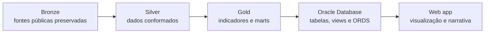

# Arquitetura do MedFlow

Este documento apresenta o mapa técnico do MedFlow no recorte oficial de São Paulo, de janeiro de 2024 a junho de 2026. Ele registra o desenho vigente, as decisões que orientam o projeto e o ponto atual da entrega. Detalhes operacionais ficam nos READMEs de cada camada e nos contratos versionados no repositório.

## 1. Fluxo end-to-end

Cada etapa tem uma responsabilidade única. Bronze preserva a origem; Silver organiza e harmoniza; Gold calcula a camada analítica; o Oracle publica o modelo validado; e o web app apresenta os resultados sem recalcular indicadores.

## 2. Principais decisões

- **O pacote Python é o motor do pipeline.** Os notebooks são materiais narrativos e de exploração, não a implementação oficial.
- **Bronze não aplica regra de negócio.** A camada preserva o conteúdo de origem, acrescentando somente rastreabilidade e controles de integridade.
- **Silver concentra a conformação.** Tipos, nomes canônicos, relacionamentos e de/paras documentados são resolvidos antes de qualquer indicador.
- **Gold é a única fonte dos indicadores.** Banco, API e frontend apenas carregam, expõem ou formatam os resultados dessa camada.
- **O recorte oficial é SP, de 2024-01 a 2026-06.** Generalização multi-UF não faz parte da entrega atual.
- **Contratos e metadados substituem números fixos.** Manifestos, schemas e reconciliações verificam estrutura, proveniência e volume sem acoplar o código a totais históricos.
- **Oracle é o backend único.** Não existe uma segunda base operacional para servir a aplicação.
- **ORDS publica somente leitura.** Produção replica os módulos validados em desenvolvimento e passa por uma verificação de identidade antes da publicação.
- **O frontend não recalcula métricas.** Ele consome a API, formata valores e explicita quando usa o snapshot de contingência.
- **Dados pesados são reproduzíveis e ficam fora do Git.** Apenas código, contratos e pequenas referências oficiais necessárias à reprodutibilidade são versionados.
- **Uma release só é marcada depois dos portões técnicos.** Pipeline, contratos, reconciliação, testes da API e testes do frontend precisam estar consistentes.

## 3. Status atual — 16/08/2026

| Área | Situação |
|---|---|
| Bronze, Silver e Gold | Implementadas e validadas para SP, 2024-01 a 2026-06 |
| Oracle | 9 tabelas analíticas carregadas, totalizando 597.725 linhas |
| Reconciliação | 8.403.103 comparações de campos entre Gold e Oracle, sem divergências |
| API pública | `api/v1` publicada com 10 endpoints GET; amostra de 31.792 campos reconciliada sem divergências |
| Web app | Publicado em [lucas-d-s-1.github.io/medflow](https://lucas-d-s-1.github.io/medflow/) |
| Trabalho em curso | Melhorar o onboarding para novos colaboradores e concluir duas telas da interface |
| Próximos portões | Revalidar Select AI, finalizar apresentação e vídeo e então preparar a release `v0.3` |

## 4. Construção técnica por etapa

### 4.1 Bronze

A Bronze é implementada em `src/medflow/bronze/` e executada por `medflow bronze` ou `make bronze`. Ela ingere as fontes públicas do DATASUS usadas pelo projeto: arquivos SIH/RD de internações, CNES/LT de leitos e pequenas referências oficiais do Ministério da Saúde e do IBGE. O processo descobre os períodos disponíveis dentro do recorte configurado, baixa apenas o que estiver ausente e mantém os artefatos de origem e caches intermediários necessários à conversão. Arquivos DBC e DBF são transformados em Parquet fiel, sem imputação, agregação ou aplicação de regra clínica. As únicas colunas adicionais são de linhagem, como fonte, competência e momento de ingestão. Um manifesto registra arquivo, origem, tamanho, quantidade de registros e hash, permitindo detectar corrupção ou mudança silenciosa na fonte. As referências pequenas e estáveis podem ser versionadas para proteger a execução contra URLs externas instáveis; os volumes pesados permanecem ignorados pelo Git. Ao final, contratos e manifestos verificam schema, cobertura temporal e integridade. Essa separação garante que qualquer regra posterior seja auditável e que os dados originais possam ser reproduzidos sem depender de cópias locais de outro integrante.

### 4.2 Silver

A Silver vive em `src/medflow/silver/` e é produzida por `medflow silver` ou `make silver`. Ela lê exclusivamente a Bronze validada e converte os campos de origem em um modelo canônico: nomes em `snake_case`, tipos explícitos, chaves normalizadas e categorias traduzidas por de/paras documentados. O resultado contém seis dimensões e duas tabelas fato, incluindo internações e a fotografia mensal de leitos. Relacionamentos entre município, estabelecimento, especialidade, competência e região são resolvidos aqui, antes das métricas. O mapeamento geográfico usa referências oficiais; atributos atuais do CNES que não representam uma dimensão historizada permanecem identificados como tal. Regras conceituais, como distinguir uma internação iniciada no período de uma permanência herdada, também ficam explícitas e testáveis. As agregações preservam categorias nulas quando elas representam informação da fonte, evitando perda silenciosa de volume. Além dos Parquets conformados, a camada gera relatórios de qualidade, metadados e evidências de mapeamento. Testes validam schemas, chaves, cobertura, totais reconciliáveis e caminhos de falha. Assim, a Gold recebe dados homogêneos e não precisa repetir limpeza, joins frágeis ou interpretações da codificação original.

### 4.3 Gold

A Gold é construída principalmente por `src/medflow/gold.py`, com módulos especializados para ICSAP, IPCA e geografia, e executada por `medflow gold` ou `make gold`. Ela consome somente a Silver contratada e materializa sete marts analíticos, duas dimensões geográficas e os artefatos GeoJSON/TopoJSON usados na visualização. Nessa etapa são calculados os indicadores oficiais do projeto, entre eles tempo médio de permanência, proporção de internações, índice de sazonalidade, custo médio nominal e real, um proxy de pressão hospitalar, fluxos territoriais e ICSAP em 19 grupos. Fórmulas, denominadores, arredondamentos e limites de aplicabilidade ficam centralizados no código e descritos nos metadados; valores exibidos não são digitados manualmente. O comando Gold inclui a geração geográfica para manter um contrato único de nove tabelas entre arquivo, banco e API. Validações conferem invariantes, bordas temporais, reconciliação de somas e consistência espacial, produzindo a evidência técnica da execução. Gold é a fronteira semântica do sistema: qualquer consumidor posterior deve utilizar seus resultados prontos. Essa regra evita que SQL, ORDS ou React criem versões concorrentes de um mesmo indicador e torna divergências rastreáveis até um único ponto de cálculo.

### 4.4 Oracle Database

O backend usa Oracle Autonomous AI Database 26ai Lakehouse no schema `MEDFLOW`. Scripts em `db/` criam e carregam duas dimensões e sete marts na ordem exigida pelas dependências, preservando no banco a mesma granularidade e os mesmos tipos lógicos da Gold. A carga atual contém 597.725 linhas e é verificada por métricas de qualidade, contratos e reconciliação campo a campo com os Parquets. Views de projeção formam a fronteira de publicação: elas selecionam e nomeiam os campos necessários, mas não recalculam indicadores. Sobre essas views, o ORDS expõe dez handlers GET. O módulo `api/dev/v1` é usado para homologação local; `api/v1` é a versão pública, com CORS restrito ao domínio do GitHub Pages e uma verificação de identidade entre os artefatos homologados e publicados. O perfil Select AI permite perguntas controladas sobre o modelo, sem substituir os contratos da API. Credenciais, wallet mTLS e arquivos `.env` nunca entram no Git e só são necessários para carga, reconciliação ao vivo ou administração. Para o trabalho comum, os testes estáticos e o pipeline de arquivos funcionam sem acesso ao Oracle. A documentação operacional separa criação, carga, publicação e diagnóstico para reduzir ações acidentais.

### 4.5 Web app

O web app é uma aplicação React 19 com TypeScript e Vite, organizada por funcionalidades e publicada no GitHub Pages. As rotas cobrem visão regional, fluxos, hospital e metodologia, apoiadas por dez clientes que correspondem aos endpoints públicos do ORDS. A URL-base da API é centralizada: durante o desenvolvimento, o Vite encaminha `/api/dev/v1` ao Oracle; no build público, a aplicação usa a origem absoluta de `api/v1`. `base`, `basename` e a página de fallback tratam corretamente o subcaminho `/medflow/` e a navegação direta em rotas do Pages. Componentes não calculam indicadores: recebem valores contratados e aplicam apenas formatação de apresentação com `Intl`. Cada endpoint possui snapshot de contingência compatível com o mesmo recorte, e a interface informa de modo explícito se a origem é Oracle ao vivo ou snapshot; o fallback não pode alterar silenciosamente o período exibido. Estados de carregamento, ausência e erro fazem parte do comportamento esperado. Playwright cobre cenários herméticos e, separadamente, smoke tests contra a API publicada. O workflow de Pages executa `npm ci`, build e deploy, seguido de verificações do HTML e do bundle. A aplicação está disponível em [lucas-d-s-1.github.io/medflow](https://lucas-d-s-1.github.io/medflow/).
