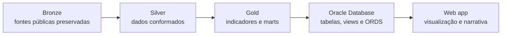

# Arquitetura do MedFlow

Este documento apresenta o mapa técnico do MedFlow no recorte oficial de São Paulo, de janeiro de 2024 a junho de 2026. Ele registra o desenho vigente, as decisões que orientam o projeto e o ponto atual da entrega. Detalhes operacionais ficam nos READMEs de cada camada e nos contratos versionados no repositório.

## 1. Fluxo end-to-end

Cada etapa tem uma responsabilidade única:

- **Bronze** preserva a origem;
- **Silver** organiza e harmoniza;
- **Gold** calcula a camada analítica;
- **Oracle** publica o modelo validado;
- **web app** apresenta os resultados, sem recalcular indicadores.

## 2. Principais decisões

- **O pacote Python é o motor do pipeline.** Os notebooks são materiais narrativos e de exploração, não a implementação oficial.
- **Bronze não aplica regra de negócio.** A camada preserva o conteúdo de origem, acrescentando somente rastreabilidade e controles de integridade.
- **Silver concentra a conformação.** Tipos, nomes canônicos, relacionamentos e de/paras documentados são resolvidos antes de qualquer indicador.
- **Gold é a única fonte dos indicadores.** Banco, API e frontend apenas carregam, expõem ou formatam os resultados dessa camada.
- **O recorte oficial é SP, de 2024-01 a 2026-06.** Generalização multi-UF não faz parte da entrega atual.
- **Contratos e metadados substituem números fixos.** Manifestos, schemas e reconciliações verificam estrutura, proveniência e volume sem acoplar o código a totais históricos.
- **Oracle é o backend único.** Não existe uma segunda base operacional para servir a aplicação.
- **ORDS publica somente leitura.** Produção replica os módulos validados em desenvolvimento e passa por uma verificação de identidade antes da publicação.
- **O frontend não recalcula métricas.** Ele consome a API, formata valores e explicita quando usa o snapshot de contingência.
- **Dados pesados são reproduzíveis e ficam fora do Git.** Apenas código, contratos e pequenas referências oficiais necessárias à reprodutibilidade são versionados.
- **Uma release só é marcada depois dos portões técnicos.** Pipeline, contratos, reconciliação, testes da API e testes do frontend precisam estar consistentes.

## 3. Status atual — 27/08/2026

| Área | Situação |
|---|---|
| Bronze, Silver e Gold | Implementadas e validadas para SP, 2024-01 a 2026-06 |
| Oracle | 12 tabelas analíticas carregadas, incluindo 3 dimensões territoriais |
| Reconciliação | 8.403.103 comparações de campos entre Gold e Oracle, sem divergências |
| API pública | `api/v1` publicada com 10 endpoints GET; amostra de 31.792 campos reconciliada sem divergências |
| Web app | Publicado em [lucas-d-s-1.github.io/medflow](https://lucas-d-s-1.github.io/medflow/) |
| Web app — escopo | Quatro visões: regional, fluxos, hospital e metodologia. A interface permanece nessas quatro; mudanças restritas a texto e acabamento |
| Trabalho em curso | Onboarding para novos colaboradores e revisão final dos entregáveis da Sprint 2 |
| Próximos portões | Revalidar o Select AI contra o produto, marcar a release `v0.3.0` e fechar apresentação e vídeo |

## 4. Construção técnica por etapa

### 4.1 Bronze

A Bronze é implementada em `src/medflow/bronze/` e executada por `medflow bronze` ou `make bronze`. Ela ingere as fontes públicas do DATASUS usadas pelo projeto: arquivos SIH/RD de internações, CNES/LT de leitos e pequenas referências oficiais do Ministério da Saúde e do IBGE. O processo descobre os períodos disponíveis dentro do recorte configurado, baixa apenas o que estiver ausente e mantém os artefatos de origem e caches intermediários necessários à conversão. Arquivos DBC e DBF são transformados em Parquet fiel, sem imputação, agregação ou aplicação de regra clínica. As únicas colunas adicionais são de linhagem, como fonte, competência e momento de ingestão. Um manifesto registra arquivo, origem, tamanho, quantidade de registros e hash, permitindo detectar corrupção ou mudança silenciosa na fonte. As referências pequenas e estáveis podem ser versionadas para proteger a execução contra URLs externas instáveis; os volumes pesados permanecem ignorados pelo Git. Ao final, contratos e manifestos verificam schema, cobertura temporal e integridade. Essa separação garante que qualquer regra posterior seja auditável e que os dados originais possam ser reproduzidos sem depender de cópias locais de outro integrante.

### 4.2 Silver

A Silver vive em `src/medflow/silver/` e é produzida por `medflow silver` ou `make silver`. Ela lê exclusivamente a Bronze validada e converte os campos de origem em um modelo canônico: nomes em `snake_case`, tipos explícitos, chaves normalizadas e categorias traduzidas por de/paras documentados. O resultado contém nove dimensões e duas tabelas fato, incluindo internações e a fotografia mensal de leitos. As três dimensões territoriais acrescentam distrito, subprefeitura, CRS, STS e aliases pesquisáveis sem substituir a região de saúde SUS. Relacionamentos entre município, estabelecimento, especialidade, competência e região são resolvidos aqui, antes das métricas. O mapeamento geográfico usa referências oficiais; atributos atuais do CNES que não representam uma dimensão historizada permanecem identificados como tal. Regras conceituais, como distinguir uma internação iniciada no período de uma permanência herdada, também ficam explícitas e testáveis. As agregações preservam categorias nulas quando elas representam informação da fonte, evitando perda silenciosa de volume. Além dos Parquets conformados, a camada gera relatórios de qualidade, metadados e evidências de mapeamento. Testes validam schemas, chaves, cobertura, totais reconciliáveis e caminhos de falha. Assim, a Gold recebe dados homogêneos e não precisa repetir limpeza, joins frágeis ou interpretações da codificação original.

### 4.3 Gold

A Gold é construída principalmente por `src/medflow/gold.py`, com módulos especializados para ICSAP, IPCA e geografia, e executada por `medflow gold` ou `make gold`. Ela consome somente a Silver contratada e materializa sete marts analíticos, duas dimensões geográficas e os artefatos GeoJSON/TopoJSON usados na visualização. Nessa etapa são calculados os indicadores oficiais do projeto, entre eles tempo médio de permanência, proporção de internações, índice de sazonalidade, custo médio nominal e real, um proxy de pressão hospitalar, fluxos territoriais e ICSAP em 19 grupos. Fórmulas, denominadores, arredondamentos e limites de aplicabilidade ficam centralizados no código e descritos nos metadados; valores exibidos não são digitados manualmente. O comando Gold inclui a geração geográfica para manter um contrato único de nove tabelas entre arquivo, banco e API. Validações conferem invariantes, bordas temporais, reconciliação de somas e consistência espacial, produzindo a evidência técnica da execução. Gold é a fronteira semântica do sistema: qualquer consumidor posterior deve utilizar seus resultados prontos. Essa regra evita que SQL, ORDS ou React criem versões concorrentes de um mesmo indicador e torna divergências rastreáveis até um único ponto de cálculo.

### 4.4 Oracle Database

O backend usa Oracle Autonomous AI Database 26ai Lakehouse no schema `MEDFLOW`. Scripts em `db/` criam e carregam cinco dimensões e sete marts na ordem exigida pelas dependências, preservando no banco a mesma granularidade e os mesmos tipos lógicos das camadas contratadas. A migração aditiva acrescentou distrito, subprefeitura, CRS, STS, atribuição espacial atual do CNES e aliases de hospital sem recriar os marts. Views de projeção formam a fronteira de publicação: elas selecionam e nomeiam os campos necessários, mas não recalculam indicadores. Sobre essas views, o ORDS expõe dez handlers GET; a lista de hospitais aceita busca por nome ou alias e devolve a atribuição territorial atual quando disponível. O módulo `api/dev/v1` é usado para homologação local; `api/v1` é a versão pública, com CORS restrito ao domínio do GitHub Pages e uma verificação de identidade entre os artefatos homologados e publicados. O perfil Select AI foi sincronizado com os doze objetos analíticos, sem reexecutar a bateria de inferência. Credenciais, wallet mTLS e arquivos `.env` nunca entram no Git e só são necessários para carga, reconciliação ao vivo ou administração. Para o trabalho comum, os testes estáticos e o pipeline de arquivos funcionam sem acesso ao Oracle. A documentação operacional separa criação, carga, publicação e diagnóstico para reduzir ações acidentais.

### 4.5 Web app

O web app é uma aplicação React 19 com TypeScript e Vite, organizada por funcionalidades e publicada no GitHub Pages. As rotas cobrem visão regional, fluxos, hospital e metodologia, apoiadas por dez clientes que correspondem aos endpoints públicos do ORDS. A URL-base da API é centralizada: durante o desenvolvimento, o Vite encaminha `/api/dev/v1` ao Oracle; no build público, a aplicação usa a origem absoluta de `api/v1`. `base`, `basename` e a página de fallback tratam corretamente o subcaminho `/medflow/` e a navegação direta em rotas do Pages. Componentes não calculam indicadores: recebem valores contratados e aplicam apenas formatação de apresentação com `Intl`. Cada endpoint possui snapshot de contingência compatível com o mesmo recorte, e a interface informa de modo explícito se a origem é Oracle ao vivo ou snapshot; o fallback não pode alterar silenciosamente o período exibido. Estados de carregamento, ausência e erro fazem parte do comportamento esperado. Playwright cobre cenários herméticos e, separadamente, smoke tests contra a API publicada. O workflow de Pages executa `npm ci`, build e deploy, seguido de verificações do HTML e do bundle. A aplicação está disponível em [lucas-d-s-1.github.io/medflow](https://lucas-d-s-1.github.io/medflow/).

## 5. Segurança, privacidade e governança

O MedFlow trabalha apenas com dado público e agregado, e a arquitetura precisa
manter essa fronteira explícita.

- somente dados públicos e agregados chegam ao navegador; nenhuma linha
  individual de AIH e nenhum dado pessoal são expostos;
- wallet, `.env`, senhas e tokens permanecem fora do Git, e o navegador nunca
  recebe credencial Oracle;
- os endpoints aceitam somente leitura, com parâmetros enumerados e validados;
- estruturas internas não são publicadas por AutoREST — cada handler é escrito
  sobre uma view de projeção;
- o CORS é restrito aos domínios conhecidos e não é tratado como autenticação;
- logs não registram segredo nem payload sensível;
- cada publicação registra versão, competência e hash;
- mudança de fórmula exige novo contrato, entrada no changelog e revalidação;
- o Select AI roda em ambiente controlado, e o SQL gerado é revisado antes de
  qualquer narrativa.

Se o produto vier a incorporar dado pessoal, acesso institucional ou ações de
gestão, esta arquitetura de API pública deixa de ser suficiente: passariam a ser
necessários autenticação, autorização por perfil, auditoria de acesso, avaliação
LGPD e um backend protegido.

## 6. Disponibilidade, contingência e recuperação

O banco é Always Free e hiberna por inatividade, então indisponibilidade é um
estado previsto, não um incidente. A resposta é sempre a mesma: o produto
continua de pé pelo snapshot e diz na tela que está em contingência.

| Risco | Detecção | Resposta |
|---|---|---|
| Oracle hibernado | `/status` falha e o workflow fica vermelho | snapshot no web app; iniciar o banco pelo console |
| ORDS ainda inicializando | erro HTTP logo após o start | aguardar cerca de 5 minutos e repetir o preflight |
| workflow agendado desativado | ausência de execução recente | `workflow_dispatch` e atividade periódica no repositório |
| endpoint lento | timeout do cliente | contingência, log do erro e nova tentativa manual |
| carga Oracle divergente | reconciliação diferente de 36/36 | não promover a nova versão |
| Gold local divergente | o portão do pipeline falha | não exportar snapshot nem carregar o Oracle |
| Select AI gera SQL incorreto | comparação com o SQL de referência | não executar nem narrar; usar o SQL validado |
| competência mais recente parcial | metadado de corte e reprocessamento | rotular a competência e evitar linguagem de tempo real |

### Preflight da apresentação

A parte automatizável roda num comando, `make preflight`, que fala com o
produto publicado pelo mesmo caminho que o avaliador usa: sem `.env`, wallet
ou Gold local. São doze verificações: Oracle ao vivo, versão do contrato,
competência mais recente, os endpoints de cada visão, as 62 regiões carregadas,
o 404 documentado para parâmetro inválido e o link público abrindo.

O que a máquina não checa continua na mão, e o comando imprime a lista no fim:

1. abrir as duas páginas em janela anônima, sem cache nem login;
2. testar um filtro regional e um par hospital/CID elegível;
3. simular a contingência e conferir o selo de origem na tela;
4. abrir o link em outra rede ou no celular, fora do wi-fi da sala;
5. executar o roteiro controlado do Select AI uma vez, sem plateia;
6. guardar screenshots ou um vídeo curto como última contingência visual.

### Manter o banco acordado

O Always Free para sozinho depois de sete dias sem atividade, e entre a entrega
e a banca há treze dias em que ninguém necessariamente abre o produto. O
workflow `.github/workflows/heartbeat.yml` roda todo dia às 09h10 UTC, lê o
`/status` e uma linha real dos marts pelo módulo público, e confere o site no
Pages. Chamada ao ORDS executa SQL, e SQL conta como atividade.

Ele **impede** o banco de dormir; não o acorda. Se já estiver parado, o
workflow fica vermelho e o passo final imprime o procedimento: iniciar pelo
console OCI, esperar cerca de cinco minutos pelo ORDS e reexecutar.

## 7. Decisões que evitam complexidade sem valor

| Alternativa | Decisão | Motivo |
|---|---|---|
| Power BI como entrega | não usar no MVP | compartilhar sem licença paga é requisito do projeto |
| Supabase entre app e Oracle | não usar | duplicaria a Gold em PostgreSQL e criaria sincronização |
| backend próprio 24×7 | não usar agora | o ORDS já publica consultas HTTPS/JSON sobre o Oracle |
| AutoREST das tabelas | não usar | superfície maior e contrato acoplado ao modelo físico |
| fórmulas no frontend | não usar | criaria uma segunda fonte de regra de negócio |
| chat Select AI público | não usar agora | exigiria controles adicionais de custo, segurança e validação |
| esconder a indisponibilidade | não usar | o snapshot sempre recebe selo de contingência |
| semáforo clínico arbitrário | não usar | falta validação de especialista e ajuste de risco |

## 8. Custos e dependências

O desenho busca custo financeiro recorrente zero no MVP:

- Oracle Autonomous AI Database Always Free;
- OCI Generative AI conforme a disponibilidade e os limites da conta acadêmica;
- GitHub Pages e GitHub Actions em repositório público;
- React, TypeScript e bibliotecas de visualização open source.

"Sem mensalidade" não é o mesmo que "sem custo operacional". Permanecem o
esforço de atualizar dados, revisar reprocessamentos, monitorar a hibernação,
validar indicadores, corrigir dependências e executar o preflight.

## 9. Referências

### Internas

- [`contracts/openapi.yaml`](contracts/openapi.yaml) — o contrato dos 10 endpoints
- [`contracts/NOMENCLATURA.md`](contracts/NOMENCLATURA.md) — convenção de tabelas e colunas
- [`db/README.md`](db/README.md) — criação, carga, publicação e diagnóstico no Oracle
- [`docs/decisoes/DECISOES.md`](docs/decisoes/DECISOES.md) — decisões de escopo, domínio e produto
- [`docs/decisoes/REVISAO_REQUISITOS_E_PROPOSTA_GOLD.md`](docs/decisoes/REVISAO_REQUISITOS_E_PROPOSTA_GOLD.md)
- [`docs/pesquisa/pesquisa.md`](docs/pesquisa/pesquisa.md) — validação do problema e benchmarking

### Oficiais

- [Oracle — Always Free Autonomous AI Database](https://docs.oracle.com/en-us/iaas/autonomous-database-serverless/doc/autonomous-always-free.html)
- [Oracle — inatividade e parada do Always Free](https://docs.oracle.com/en/cloud/paas/autonomous-database/serverless/adbsb/autonomous-always-free.html)
- [Oracle — ORDS Developer's Guide](https://docs.oracle.com/en/database/oracle/oracle-rest-data-services/26.2/orddg/oracle-rest-data-services-developers-guide.pdf)
- [Oracle — Select AI](https://docs.oracle.com/en/database/oracle/oracle-database/26/nfcoa/select_ai.html)
- [GitHub — criação de site no Pages](https://docs.github.com/en/pages/getting-started-with-github-pages/creating-a-github-pages-site)
- [GitHub — eventos agendados em Actions](https://docs.github.com/en/actions/reference/workflows-and-actions/events-that-trigger-workflows)
