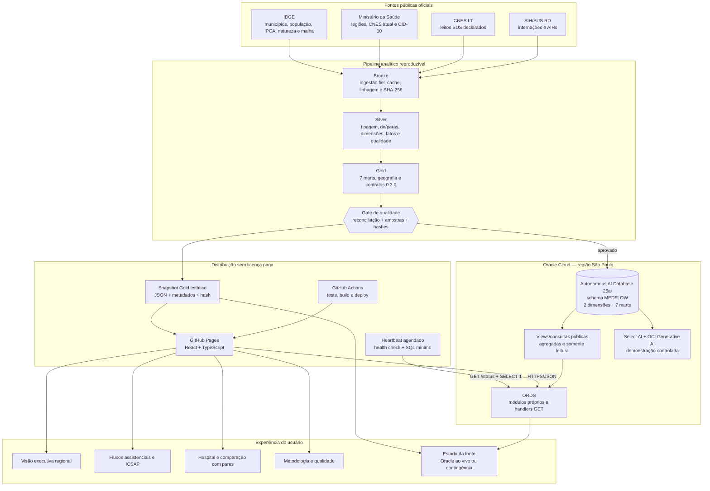
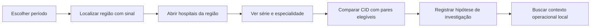

# Arquitetura end-to-end do MedFlow

**Documento de decisão e validação · contrato de dados `0.3.0` · 11/08/2026**

Este é o documento único de arquitetura do MedFlow, do dado oficial ao consumo
pelo usuário: o zoneamento das três camadas e suas fronteiras, os controles que
bloqueiam a promoção, a ligação com o Oracle, a API, o webapp, a contingência e
o processo de validação.

Ele resulta da fusão de três documentos que descreviam a mesma arquitetura em
recortes diferentes — `arquitetura.md`, `ARQUITETURA_CAMADAS.md` e
`PIPELINE.md`. Três descrições da mesma coisa divergem, e divergiram: cada uma
carregava uma volumetria própria, e duas ficaram para trás quando o recorte
avançou.

A validação do problema de negócio, o benchmarking e o protocolo de pesquisa
estão em [`docs/pesquisa/pesquisa.md`](docs/pesquisa/pesquisa.md).

## 1. Decisão executiva

O produto final do MVP será um **webapp público, responsivo e sem dependência de
licenças pagas**, construído em React e TypeScript e publicado no GitHub Pages.
Os dados normais de navegação virão do Oracle Autonomous AI Database por
endpoints HTTPS/JSON controlados no Oracle REST Data Services (ORDS).

O Power BI deixa de ser o produto final porque o compartilhamento sem licença é
uma restrição do projeto. O Supabase também não entra na arquitetura: cada
projeto Supabase possui um banco PostgreSQL, portanto sua adoção exigiria copiar
ou sincronizar a Gold que já está no Oracle, introduzindo uma segunda fonte de
verdade sem resolver uma necessidade do MVP.

O webapp terá duas rotas de continuidade:

1. Oracle disponível: consulta ao vivo via ORDS, com selo de origem e horário do
   banco;
2. Oracle indisponível: snapshot estático da mesma Gold, identificado de forma
   explícita como contingência.

O Select AI permanece como demonstração controlada de capacidade Oracle. No
MVP, ele **não será exposto diretamente como um chat público**: as visões do
produto usam consultas determinísticas e auditáveis; as perguntas em linguagem
natural são revalidadas e apresentadas separadamente.

## 2. Problema ao qual a arquitetura deve responder

> Gestores regionais de saúde de São Paulo precisam integrar e interpretar dados
> mensais de internações SIH/SUS, capacidade declarada CNES, sazonalidade e
> comparação entre hospitais e regiões para decidir onde investigar primeiro.
> Hoje essas leituras exigem combinar fontes e regras técnicas distintas, o que
> aumenta o esforço e o risco de interpretação inconsistente.

O MedFlow reduz o tempo entre “há muitos dados públicos” e “qual região,
hospital, especialidade ou diagnóstico merece investigação?”. Ele é um produto
de **triagem analítica e apoio à decisão**, não um sistema transacional de
regulação hospitalar.

### 2.1 O que o produto entrega

- uma leitura executiva das 62 regiões de saúde de São Paulo;
- comparação temporal por região e hospital;
- comparação de hospital com pares regionais por diagnóstico;
- filtros e explicações que preservam amostra, denominador e limitações;
- rastreabilidade da fonte oficial à métrica exibida;
- acesso público por link, sem conta de Power BI ou instalação local;
- evidência de uso do Oracle tanto como banco servido ao produto quanto por meio
  do Select AI.

### 2.2 O que o produto não promete

- ocupação de leitos em tempo real;
- disponibilidade operacional de um leito específico;
- gestão de fila, transferência ou regulação de pacientes;
- avaliação causal da qualidade de um hospital;
- recomendação automática de alocação de recursos;
- custo contábil completo de uma internação;
- previsão epidemiológica definitiva com apenas dois anos-base.

## 3. Arquitetura lógica



## 4. As três camadas: responsabilidade e fronteira

O zoneamento segue a referência da fase 3 do curso, com os nomes que o projeto
adotou:

| Termo da aula | Termo do projeto | Responsabilidade |
|---|---|---|
| Raw | Bronze | preservar fontes, linhagem e serializações fiéis |
| Trusted | Silver | tipar, conformar, reconciliar, documentar dimensões e fatos |
| Curated | Gold | aplicar regras de negócio, indicadores, agregações e ativos de BI |
| Refined | Platinum | fora do escopo atual |

O que cada camada **pode** e **não pode** fazer é o que impede a regra de
negócio de vazar para onde ela não é auditável.

### Bronze — adquirir e preservar

Executada por `medflow bronze`.

Permitido: download e cache; descoberta da última competência comum de SIH/RD e
CNES/LT; descompressão técnica DBC/DBF; serialização em Parquet; metadados de
linhagem; manifesto com hashes, esquema e volumetria.

Proibido: filtro analítico, preenchimento de ausência, de/para, normalização de
código de negócio, dimensão, fato ou indicador.

Estrutura: `origem/datasus` guarda o DBC imutável; `origem/referencias`, os
JSON, ZIP, HTML, CSV e a malha oficial; `intermediario/dbf` é cache técnico
descartável; `parquet` é a serialização fiel.

Fronteiras: o DBF é cache, não fonte soberana; o Parquet pode acrescentar
apenas arquivo e competência de origem; nomes de coluna permanecem iguais aos
da fonte.

### Silver — conformar e reconciliar

Executada por `medflow silver`.

Inclui tipagem, todos os de/paras, dimensões e fatos com nomes canônicos,
classificação de qualidade e origem, reconciliações antes da promoção e
documentação automática de esquema, domínios e qualidade.

Proibido: indicador, benchmark ou classificação de negócio; publicação de
agregados `base_*`; exposição de nome bruto quando já existe conceito canônico.

Fronteiras: contém somente dimensões e fatos reutilizáveis; mantém a
competência como chave `cd_competencia`.

### Gold — aplicar os contratos de negócio

Executada por `medflow gold`.

Inclui TMH e CMI por hospital, especialidade e mês; IPR por hospital/CID com
benchmark regional que exclui o próprio hospital; IS regional de 2026 contra
2024–2025; IPH por mês civil sobre pacientes-dia reconstruídos; permanência
média e CMI real corrigido pelo IPCA; demanda por região de residência e taxa
populacional territorialmente coerente; fluxos origem–destino e evasão
intrastadual observada; ICSAP por residência nos 19 grupos oficiais; e os
ativos geográficos CSV, GeoJSON e TopoJSON.

Fronteiras: registra amostras e denominadores insuficientes **sem descartá-los**;
oferece chaves regionais consistentes em todos os marts; separa região de
residência da região do hospital; preserva o CMI nominal ao lado do real; e
mantém explícito que o IPH é pressão estimada, não ocupação real.

## 5. Estrutura física do repositório

```text
medflow/
├── src/medflow/          o pipeline: config, bronze, silver, gold, oracle
├── db/                   o backend: schema, views, módulos ORDS e Select AI
├── web/                  o produto: React + Vite, agrupado por funcionalidade
├── contracts/            contratos de dados, OpenAPI, nomenclatura e inventários
├── notebooks/            a narrativa do pipeline — leitura, não motor
├── data/                 as camadas materializadas; quase tudo fora do Git
├── docs/                 decisões, pesquisa e evidência datada
├── tests/                unidade, contrato, OpenAPI e reconciliação
└── scripts/              utilitários de manutenção
```

Cada pasta tem um README que responde o quê, por quê e como. A árvore é
posterior à reorganização de 08/08/2026; a anterior, com `sprint_2_em_andamento/`,
`pipeline/` e `dados/`, permanece no repositório acadêmico `fiap-1tscoa` e no
histórico do Git.

## 6. Estado real versus arquitetura-alvo

| Componente | Estado em 11/08/2026 | Evidência |
|---|---|---|
| Bronze, Silver e Gold | implementado e validado | seções 4 e 8; `VALIDACAO_TECNICA.md` |
| Geografia das regiões | implementada e validada | 645 municípios, 62 regiões, 19 macrorregiões |
| Oracle Autonomous AI Database | implementado e validado | [`db/README.md`](db/README.md) |
| Carga dimensional Oracle | implementada e reconciliada | 597.725 linhas; 36/36 controles `ok` |
| Select AI | validado tecnicamente | [`docs/qualidade/VALIDACAO_ORACLE_SELECT_AI.md`](docs/qualidade/VALIDACAO_ORACLE_SELECT_AI.md) |
| Views públicas de projeção | implementadas | nove views em `db/views/` |
| Endpoints ORDS próprios | implementados | dez handlers `GET` em `db/ords/`; contrato em [`contracts/openapi.yaml`](contracts/openapi.yaml) |
| Webapp React/TypeScript | implementado e revisado | quatro visões em `web/`; Playwright 32/32 |
| Snapshot de contingência | implementado | dez snapshots em `web/src/mocks/`, regerados por `make fixtures` |
| Reconciliação API × Gold | implementada e versionada | `tests/reconciliacao/`; `make reconciliar-completo` |
| Módulo ORDS de produção `api/v1` | **não existe** | só há o módulo de teste `api/dev/v1` |
| Deploy e link público | **não existe** | é a etapa atual; ver `PENDENCIAS.md` |
| Heartbeat e alerta | **não existe** | o ping do Oracle é manual e semanal |
| Validação com usuários | evolução futura, não bloqueante | roteiro opcional em [`docs/pesquisa/pesquisa.md`](docs/pesquisa/pesquisa.md) |

Esta tabela existe para impedir que a arquitetura desejada seja apresentada
como funcionalidade entregue. As três linhas em negrito são o que falta, e é
por isso que estão escritas assim.

## 7. Processo completo

### Etapa 0 — determinar o recorte reproduzível

O extrator consulta as competências disponíveis e usa a última competência
comum entre SIH/RD e CNES/LT dentro do intervalo solicitado. O recorte atual é
São Paulo, de janeiro de 2024 a junho de 2026, totalizando 30 competências.

O mês mais recente deve aparecer no produto como **competência disponível**, e
não como “dado em tempo real”. O SIH aceita apresentação e reprocessamento de
competências anteriores; por isso, toda atualização deve registrar data de
extração, competência máxima e hash dos arquivos.

### Etapa 1 — preservar as fontes na Bronze

O notebook `00_extracao_dados.ipynb`:

- baixa SIH/RD e CNES/LT;
- guarda DBC e demais arquivos oficiais recebidos;
- usa DBF somente como cache técnico reproduzível;
- serializa o conteúdo fielmente em Parquet;
- acrescenta apenas linhagem de arquivo e competência;
- registra esquema, volume, origem e SHA-256 no manifesto;
- reaproveita arquivos íntegros já existentes e não duplica o recorte.

Nenhum filtro analítico, indicador, imputação ou classificação de negócio é
permitido nessa camada.

### Etapa 2 — conformar e reconciliar a Silver

O notebook `01_engenharia_dados.ipynb`:

- tipa os campos analíticos;
- aplica de/paras documentados;
- diferencia AIH aprovada, internação nova e continuação;
- preserva `N_AIH`, `IDENT`, `COD_IDADE`, `QT_DIARIAS` e `DIAS_PERM`;
- associa municípios às regiões oficiais;
- cria dimensões e fatos canônicos;
- explicita atributos atuais que não podem ser tratados como históricos;
- bloqueia a promoção se as reconciliações falharem.

A Silver validada contém 7.284.476 AIHs, das quais 7.150.693 representam
internações novas e 133.783 são continuações de longa permanência.

### Etapa 3 — aplicar contratos de negócio na Gold

O notebook `02_analise_dados.ipynb` produz sete marts:

| Mart | Grão | Linhas | Uso principal |
|---|---|---:|---|
| `mart_indicador_hospital_mensal` | hospital × mês | 19.341 | IPH, TMH, CMI nominal/real e permanência média |
| `mart_indicador_hospital_especialidade_mensal` | hospital × especialidade × mês | 54.328 | perfil, amostra, permanência e CMI real |
| `mart_indicador_hospital_cid_periodo` | hospital × CID no período | 455.054 | IPR e benchmark regional |
| `mart_indicador_regiao_mensal` | região × mês | 1.860 | oferta, demanda residente, IS, fluxo e ICSAP |
| `mart_indicador_regiao_periodo` | região no período | 62 | síntese regional do IPR |
| `mart_fluxo_assistencial_regiao_mensal` | origem de residência × atendimento × mês | 31.033 | matriz de referência, atração e dependência |
| `mart_icsap_regiao_mensal` | residência × mês × grupo ICSAP | 35.340 | taxa e composição dos 19 grupos oficiais |

A Gold também publica as dimensões geográficas de 645 municípios e 62 regiões,
além de GeoJSON e TopoJSON para o mapa.

### Etapa 4 — executar o gate de qualidade

A publicação deve parar quando qualquer controle bloqueante falhar. O gate
inclui:

- reconciliação de linhas entre camadas;
- recomputação das fórmulas a partir de numeradores e denominadores;
- cobertura de chaves e domínios;
- validação das relações hospital–região;
- preservação de amostras insuficientes e denominadores zero;
- conferência de hashes e versão do contrato;
- validação das 62 geometrias regionais.

O status atual do pipeline é aderente ao contrato `0.3.0`.

### Etapa 5 — carregar e reconciliar o Oracle

O script `src/medflow/oracle/carregar_gold.py` carrega duas dimensões e sete marts no
schema `MEDFLOW`. A operação é idempotente para uma carga completa: limpa as
tabelas na ordem segura e reinsere os arquivos Gold.

Depois da carga, `db/schema/03_validar_carga.sql` compara 36 métricas com os
metadados locais. O produto só pode trocar para a nova versão quando todas
retornarem `ok`. A carga atual possui 597.725 linhas no Oracle e seis consultas
de integridade retornam vazias. Os valores esperados do SQL são regenerados a
partir dos metadados por `scripts/atualizar_esperados_sql.py`, e não ficam
congelados no arquivo.

### Etapa 6 — publicar um contrato de leitura via ORDS

O navegador não recebe usuário, senha, wallet ou chave Oracle. Ele acessa
somente módulos ORDS próprios, com handlers `GET` que executam consultas
pré-definidas sobre dados agregados.

Não será usado AutoREST nas tabelas Gold. O motivo é reduzir superfície e
impedir que operações ou estruturas desnecessárias sejam publicadas. CORS será
limitado aos domínios do webapp; isso é uma política de navegador, não um
mecanismo de autenticação. Como os dados são públicos e agregados, os endpoints
podem ser publicamente consultáveis, mas continuam restritos a consultas de
leitura, parâmetros validados e volume limitado.

Contrato inicial proposto:

| Endpoint | Finalidade | Consumidor |
|---|---|---|
| `GET /ords/medflow/api/v1/status` | saúde do banco, horário, contrato e competência máxima | selo de fonte e heartbeat |
| `GET /regioes/resumo?ano=&mes=` | cartões e mapa regional | visão executiva |
| `GET /regioes/{id}/serie` | evolução mensal da região | detalhe executivo |
| `GET /fluxos?ano=&mes=&origem=&destino=` | matriz agregada residência–atendimento | fluxo assistencial |
| `GET /icsap?regiao=&ano=&mes=` | taxa e composição dos 19 grupos | atenção primária |
| `GET /hospitais?regiao=` | hospitais elegíveis da região | navegação e ranking |
| `GET /hospitais/{cnes}/serie` | série mensal do hospital | visão hospitalar |
| `GET /hospitais/{cnes}/especialidades` | perfil por especialidade | detalhe hospitalar |
| `GET /hospitais/{cnes}/cids` | IPR por diagnóstico e referência regional | comparação com pares |
| `GET /metodologia` | versão, cortes, cobertura e notas | tela de transparência |

O endpoint `status` deve devolver, no mínimo:

```json
{
  "status": "ok",
  "source": "oracle-live",
  "database_time": "2026-08-01T12:00:00-03:00",
  "data_through": "2026-06",
  "contract_version": "0.3.0"
}
```

As respostas devem ter paginação ou limites explícitos, tipos estáveis e uma
versão no caminho da API. Mudanças incompatíveis criam `v2`; não alteram
silenciosamente `v1`.

### Etapa 7 — construir o webapp

O front-end será uma aplicação estática React + TypeScript. Uma aplicação
estática basta porque toda consulta dinâmica ocorre via ORDS e não há sessão,
senha ou regra de negócio sensível no cliente.

Responsabilidades do webapp:

- montar filtros e chamar somente endpoints versionados;
- formatar indicadores sem recalculá-los;
- mostrar denominador, amostra e nota metodológica quando necessário;
- distinguir carregamento, ausência legítima, erro e contingência;
- oferecer URL compartilhável para o estado principal dos filtros;
- permitir uso em notebook e tela de apresentação;
- registrar no selo a fonte efetivamente usada.

As regras de indicador permanecem no pipeline/Oracle. O front-end não deve
reimplementar fórmulas em JavaScript.

### Etapa 8 — acionar a contingência transparente

Durante o build, um exportador transforma o mesmo contrato Gold em arquivos
JSON compactos e registra competência, versão e SHA-256. Esses arquivos são
publicados com o webapp.

Fluxo de decisão do cliente:

1. chamar `/status` com timeout curto;
2. se o Oracle responder, carregar a API e mostrar `Oracle ao vivo`;
3. se houver timeout ou erro, carregar o snapshot e mostrar
   `Contingência — snapshot até AAAA-MM`;
4. nunca misturar, na mesma sessão, partes silenciosamente vindas de versões
   diferentes;
5. permitir nova tentativa manual.

O snapshot não esconde indisponibilidade. Ele preserva a demonstração e torna a
falha observável.

### Etapa 9 — publicar e manter disponível

O GitHub Actions executa teste, build e deploy no GitHub Pages. Para repositório
público, GitHub Pages e Actions atendem ao requisito de não contratar licença.

Um segundo workflow executa duas vezes por semana e também por disparo manual:

1. chama `/status`;
2. o handler executa uma consulta mínima, como `SELECT 1, SYSTIMESTAMP FROM
   dual`;
3. aplica timeout e tentativas limitadas;
4. falha de forma visível no histórico do workflow;
5. pode emitir alerta, se um canal sem custo for configurado.

A Oracle documenta que uma conexão HTTPS bem-sucedida acompanhada de SQL zera
o contador de inatividade do Always Free. A instância pode parar após sete dias
inativa; se já estiver parada, o heartbeat não a inicia. Nesse caso, é preciso
ligá-la pelo console e aguardar aproximadamente cinco minutos antes de testar o
ORDS.

Workflows agendados em repositórios públicos podem atrasar e são desativados
após 60 dias sem atividade no repositório. Por isso o runbook mantém um disparo
manual e uma verificação na véspera e no dia da apresentação.

### Etapa 10 — revalidar e demonstrar o Select AI

O profile `MEDFLOW_GENAI` usa OCI Generative AI por Resource Principal, na
região de São Paulo. As 175 colunas Oracle possuem comentários usados como
contexto semântico.

Antes da apresentação:

1. executar o SQL convencional de referência;
2. executar `showsql` para a mesma pergunta;
3. conferir filtros, amostra, agregação e limite;
4. somente então executar `narrate`;
5. interromper a demonstração se o SQL gerado divergir.

O Select AI é uma camada adicional de exploração; ele não substitui os
endpoints determinísticos nem os controles do produto.

## 8. Controles e reconciliações que bloqueiam a promoção

Oito controles atravessam o pipeline, e nenhum deles é conselho: cada um é
verificado antes de uma camada ser publicada.

1. **Inventário de domínios** — cobertura medida por campo, lacunas explícitas.
2. **De/paras** — todos os códigos observados de especialidade, natureza
   jurídica, CID e UTI cobertos, com proveniência.
3. **Identificadores preservados** — `N_AIH`, `IDENT` e `COD_IDADE` no fato.
4. **Unidade de contagem** — AIH aprovada, internação nova e continuação de
   longa permanência contadas separadamente e reconciliadas entre si.
5. **Permanência** — `DIAS_PERM` alimenta permanência; `QT_DIARIAS` permanece
   nomeado como faturamento, porque é o que ele é.
6. **Região** — a região analítica vem da referência oficial municipal do MS; a
   declaração histórica do CNES/LT e seus quatro conflitos ficam preservados
   para auditoria.
7. **Nulos em agrupamento** — `dropna=False` e reconciliação impedem perda
   silenciosa.
8. **Indicadores** — calculados na Gold, com amostra, denominador,
   residência/atendimento e limitações explícitos.

### A Silver só grava se

- o fato SIH tiver as linhas registradas no `MANIFESTO.json` da Bronze — a
  igualdade é medida contra o manifesto, nunca contra um total memorizado;
- AIH normal + continuação for igual ao total do fato;
- todo código `ESPEC` observado tiver de/para;
- todo CID tiver capítulo e descrição;
- todo hospital do SIH existir na dimensão hospital, com região, natureza
  jurídica, nome e esfera atuais;
- a dimensão municipal cobrir os 645 municípios e reconciliar API e CSV
  oficiais;
- as chaves `cd_competencia`, `cd_cnes` e `cd_regiao_saude` não perderem
  cobertura.

Nome e esfera atuais **não** reescrevem o cadastro histórico: a dimensão
hospital os identifica com sufixo `_atual` e
`fl_cadastro_atual_nao_historico=1`. Exigir o atributo vigente em cada
competência de 2024–2026 demandaria uma fonte cadastral histórica que não
existe publicamente.

### As reconciliações da Gold comparam camadas, não números fixos

As internações novas têm de ser idênticas nos marts hospitalar, de
especialidade e regional; a evasão inter-regional tem de fechar com a recepção;
a ICSAP do resumo tem de bater com a soma dos 19 grupos; municípios e regiões
têm de casar com a geometria sem imputação; e hospital-mês com denominador CNES
zero é preservado com IPH nulo, não descartado.

Os valores do recorte corrente ficam em `VALIDACAO_TECNICA.md`, que é **gerado**
a cada `make validar`. Este documento não os repete de propósito: número
copiado para prosa envelhece sem avisar.

## 9. IPH: o proxy histórico e o contrato atual

O proxy usado na Sprint 1 era:

```text
SUM(QT_DIARIAS) / (leitos_SUS × dias_do_mês)
```

Ele reproduz a média `0,472168`, e isso **não** comprova ocupação real:
`QT_DIARIAS` é faturamento, a competência pode divergir da saída, e cerca de
15% das internações cruzam o mês. Medir ocupação física exigiria distribuir os
intervalos de internação no calendário e validar as regras de leito e
transferência.

O proxy permanece apenas na trilha de auditoria. O mart Gold reconstrói os
pacientes-dia pelas datas de entrada e saída e os relaciona à capacidade CNES
do mês civil; capacidade zero produz IPH nulo com status
`sem_leito_sus_declarado`. Ainda assim o resultado é **pressão estimada sobre
capacidade declarada**, e é assim que o produto o nomeia.

## 10. Contratos dos indicadores

| Indicador | Cálculo atual | Regra de leitura | Limitação obrigatória |
|---|---|---|---|
| TMH | óbitos / internações novas × 100 | exibir classificação apenas com pelo menos 30 internações | mortalidade observada, sem ajuste de risco; não mede causalmente qualidade |
| IPR | permanência média hospital/CID / benchmark regional/CID sem o hospital | mínimo 20 casos hospital/CID; benchmark com 50 casos e 3 hospitais | sinaliza variação para investigação; composição clínica pode diferir |
| IS | valor de 2026 / média do mesmo mês em 2024 e 2025 | somente meses comparáveis de jan–mai/2026 | comparação sazonal histórica, não previsão definitiva |
| CMI | valor SIH aprovado / internações novas | preservar nominal e oferecer real com IPCA e referência explícita | nenhum dos dois é custo contábil completo |
| IPH | pacientes-dia reconstruídos / leitos-dia SUS declarados no CNES | denominador zero gera nulo; nunca imputar | pressão estimada sobre capacidade declarada, não ocupação física real |
| Taxa de internação residente | internações de residentes atendidos em SP / população × 100 mil | região de residência no numerador e denominador | não observa residentes atendidos fora de SP |
| Evasão observada | residentes atendidos em outra região paulista / residentes atendidos em SP | interpretar junto da rede de referência | não é evasão total nem prova insuficiência de oferta |
| Atração assistencial | atendimentos a não residentes / produção da região | separar outra região de SP e outra UF | centros de referência podem ter atração esperada |
| ICSAP | diagnósticos da Portaria 221/2008 por residência / população × 10 mil | detalhar os 19 grupos e usar leitura populacional | não prova evitabilidade individual; proporção oficial exige outro denominador |
| Permanência média | soma dos dias / internações novas | apresentar antes do IPR | sensível ao perfil clínico |

Não serão criados sem validação de especialista limiares clínicos do tipo
“verde, amarelo e vermelho” para IPH, TMH ou IPR. Rankings devem usar linguagem
como “maior valor observado” ou “priorizar investigação”, nunca “melhor” ou
“pior hospital”.

## 11. Visões planejadas

### 7.1 Visão executiva regional

**Pergunta:** onde devo investigar primeiro neste período?

Componentes mínimos:

- filtros de competência, macrorregião e região;
- mapa das 62 regiões;
- cartões de internações, IPH estimado, TMH, CMI e indicador sazonal;
- ranking regional com tamanho de amostra;
- série do indicador selecionado;
- texto curto com competência e limitação.

Ao selecionar uma região, o produto abre a lista de hospitais e preserva o
contexto temporal.

### 7.2 Visão fluxos e atenção primária

**Pergunta:** a população é atendida no próprio território, para onde se
desloca e quais condições sensíveis mais contribuem para a demanda hospitalar?

Componentes mínimos:

- matriz ou diagrama origem–destino por competência;
- atração, atendimento intrarregional e evasão intrastadual observada;
- taxa de internação de residentes por 100 mil habitantes;
- taxa ICSAP por 10 mil habitantes;
- composição das ICSAP pelos 19 grupos oficiais;
- aviso fixo de que saídas de SP não são observadas no RD-SP.

### 7.3 Visão hospital e pares

**Pergunta:** o que explica o sinal daquela região e em quais recortes ele se
concentra?

Componentes mínimos:

- identificação do hospital e da região;
- série mensal de IPH, permanência média, TMH e CMI nominal/real;
- perfil por especialidade;
- diagnósticos elegíveis para IPR;
- valor do hospital, benchmark regional sem o hospital e tamanho das amostras;
- indicação explícita quando a comparação não é elegível.

### 7.4 Visão metodologia e qualidade

**Pergunta:** posso confiar no número e quais são seus limites?

Componentes mínimos:

- fontes e última competência;
- fórmulas completas;
- cortes de amostra;
- versão do contrato e data de atualização;
- cobertura, reconciliações e principais limitações;
- diferença entre AIH, internação, diária faturada, permanência e paciente-dia;
- estado da fonte: Oracle ao vivo ou snapshot.

Essa tela não é apêndice. Ela faz parte do produto porque evita transformar
dados administrativos em afirmações clínicas indevidas.

## 12. Jornada de decisão que será validada



O produto termina em “registrar hipótese de investigação”. A ação operacional
depende de informação local, equipe técnica e governança do gestor.

## 13. Segurança, privacidade e governança

- somente dados públicos e agregados chegam ao navegador;
- nenhum dado pessoal ou linha de AIH é exposto;
- wallet, `.env`, senhas e tokens permanecem fora do Git;
- o browser não recebe credencial Oracle;
- endpoints aceitam apenas leitura e parâmetros enumerados/validados;
- estruturas internas não são publicadas por AutoREST;
- CORS é restrito aos domínios conhecidos, sem ser tratado como autenticação;
- logs não devem registrar segredo nem payload sensível;
- cada publicação registra versão, competência e hash;
- mudanças de fórmula exigem novo contrato, changelog e revalidação;
- Select AI é executado em ambiente controlado e o SQL é revisado antes da
  narrativa.

Se, no futuro, o produto incorporar dados pessoais, acesso institucional ou
ações de gestão, esta arquitetura de API pública deixa de ser suficiente. Será
necessário autenticação, autorização por perfil, auditoria de acesso, avaliação
LGPD e um backend protegido.

## 14. Disponibilidade, observabilidade e recuperação

| Risco | Detecção | Resposta do MVP |
|---|---|---|
| Oracle hibernado | `/status` falha e workflow fica vermelho | snapshot no webapp; iniciar banco pelo console |
| ORDS ainda inicializando | HTTP de erro após start | aguardar cerca de 5 minutos e repetir preflight |
| workflow agendado desativado | ausência de execução recente | `workflow_dispatch` e atividade periódica no repositório |
| endpoint lento | timeout do cliente | contingência, log do erro e nova tentativa manual |
| carga Oracle divergente | reconciliação diferente de 36/36 | não promover nova versão |
| Gold local divergente | gate de pipeline falha | não exportar snapshot nem carregar Oracle |
| Select AI gera SQL incorreto | comparação com SQL de referência | não executar/narrar; usar SQL validado |
| competência mais recente parcial | metadado de corte e reprocessamento | rotular competência e evitar linguagem de tempo real |

### Preflight da apresentação

1. confirmar o estado `Disponível` no console Oracle;
2. chamar `/status` e conferir horário, competência e contrato;
3. abrir as quatro visões em janela anônima;
4. testar um filtro regional e um hospital/CID elegível;
5. simular a contingência e conferir o selo;
6. testar o link público em outra rede/dispositivo;
7. executar o roteiro controlado do Select AI;
8. guardar screenshots ou vídeo curto como última contingência visual.

## 15. Critérios de aceite do produto

O MVP só estará pronto para apresentação quando:

- as quatro visões responderem às perguntas definidas sem depender de explicação
  oral da equipe;
- todos os números exibidos puderem ser reconciliados com a Gold;
- a API nunca expuser credencial, fato individual ou operação de escrita;
- Oracle ao vivo e snapshot forem visualmente distinguíveis;
- o link funcionar sem login ou licença paga;
- o layout for utilizável em notebook e tela projetada;
- filtros preservarem período e região durante o aprofundamento;
- estados de amostra insuficiente e denominador zero forem compreensíveis;
- a revisão documental e técnica confirmar que a interface nunca apresenta IPH
  como ocupação real;
- o preflight completo passar na véspera da apresentação.

## 16. Sequência recomendada de implementação

1. aprovar problema, persona, decisões e limites usando `pesquisa.md`;
2. desenhar wireframes das quatro visões e testar com dados estáticos;
3. definir as views SQL e o contrato JSON de cada endpoint;
4. implementar e testar os módulos ORDS `GET`;
5. gerar o snapshot JSON pelo mesmo contrato;
6. construir o webapp sem duplicar fórmulas;
7. configurar deploy, heartbeat, timeout e contingência;
8. reconciliar cada componente visual com consultas Gold/Oracle;
9. executar revisão técnica e reconciliação visual do produto;
10. revalidar Select AI e montar a apresentação.

Testes com usuários permanecem como evolução futura caso o MedFlow continue
depois da entrega acadêmica.

## 17. Decisões que evitam complexidade sem valor

| Alternativa | Decisão | Motivo |
|---|---|---|
| Power BI como entrega | não usar no MVP | compartilhamento sem licença é requisito |
| Supabase entre app e Oracle | não usar | duplicaria a Gold em PostgreSQL e criaria sincronização |
| backend próprio 24×7 | não usar agora | ORDS já publica consultas HTTPS/JSON no Oracle |
| AutoREST das tabelas | não usar | superfície maior e contrato acoplado ao modelo físico |
| fórmulas no front-end | não usar | cria duas fontes de regra de negócio |
| chat Select AI público | não usar agora | exige controles adicionais de custo, segurança e validação |
| esconder indisponibilidade | não usar | snapshot sempre recebe selo de contingência |
| semáforo clínico arbitrário | não usar | falta validação de especialista e ajuste de risco |

## 18. Custos e dependências

O desenho busca custo financeiro recorrente zero no MVP:

- Oracle Autonomous AI Database Always Free;
- OCI Generative AI conforme disponibilidade e limites da conta acadêmica;
- GitHub Pages e GitHub Actions em repositório público;
- React, TypeScript e bibliotecas de visualização open source.

“Sem mensalidade” não significa “sem custo operacional”. Permanecem o esforço
de atualizar dados, revisar reprocessamentos, monitorar hibernação, validar
indicadores, corrigir dependências e executar o preflight.

## 19. Referências técnicas

### Internas

- [`VALIDACAO_TECNICA.md`](VALIDACAO_TECNICA.md) — gerado a cada `make validar`
- [`contracts/openapi.yaml`](contracts/openapi.yaml) — o contrato dos 10 endpoints
- [`contracts/NOMENCLATURA.md`](contracts/NOMENCLATURA.md) — convenção de tabelas e colunas
- [`docs/decisoes/REVISAO_REQUISITOS_E_PROPOSTA_GOLD.md`](docs/decisoes/REVISAO_REQUISITOS_E_PROPOSTA_GOLD.md)
- [`db/README.md`](db/README.md)
- [`docs/qualidade/VALIDACAO_ORACLE_SELECT_AI.md`](docs/qualidade/VALIDACAO_ORACLE_SELECT_AI.md)

### Oficiais

- [Oracle — Always Free Autonomous AI Database](https://docs.oracle.com/en-us/iaas/autonomous-database-serverless/doc/autonomous-always-free.html)
- [Oracle — inatividade e parada do Always Free](https://docs.oracle.com/en/cloud/paas/autonomous-database/serverless/adbsb/autonomous-always-free.html)
- [Oracle — ORDS Developer's Guide](https://docs.oracle.com/en/database/oracle/oracle-rest-data-services/26.2/orddg/oracle-rest-data-services-developers-guide.pdf)
- [Oracle — Select AI](https://docs.oracle.com/en/database/oracle/oracle-database/26/nfcoa/select_ai.html)
- [GitHub — criação de site no Pages](https://docs.github.com/en/pages/getting-started-with-github-pages/creating-a-github-pages-site)
- [GitHub — eventos agendados em Actions](https://docs.github.com/en/actions/reference/workflows-and-actions/events-that-trigger-workflows)
- [Supabase — cada projeto usa PostgreSQL](https://supabase.com/docs/guides/database/overview)
