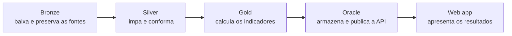

# Como instalar e entender o MedFlow

Este guia é o ponto de entrada para quem acabou de clonar o repositório. Ele
explica como preparar o ambiente, o que os comandos `make` fazem, como executar
o projeto sem credenciais e qual é a responsabilidade de cada pasta.

Para entender as decisões técnicas depois da instalação, leia também o
[`ARQUITETURA.md`](ARQUITETURA.md).

## 1. O projeto em uma imagem



O pipeline Python produz Bronze, Silver e Gold. A Gold pode ser carregada no
Oracle, o ORDS transforma views do banco em uma API somente leitura e o
frontend React consome essa API. Os notebooks ajudam a contar essa história,
mas não executam o pipeline oficial.

## 2. Pré-requisitos

Use Linux, macOS ou WSL2. O desenvolvimento deste projeto foi validado no
Ubuntu dentro do WSL2.

- Git;
- GNU Make;
- Python 3.12 ou mais recente;
- [`uv`](https://docs.astral.sh/uv/) recomendado, ou Python com `venv` e `pip`;
- Node.js 24 com npm.

Confira antes de começar:

```bash
git --version
make --version
python3 --version
uv --version       # opcional se o Python tiver venv e pip
node --version
npm --version
```

No WSL, Node e npm precisam estar instalados **dentro do Linux**. Estes
comandos não devem apontar para `/mnt/c/` nem terminar em `.exe`:

```bash
command -v node
command -v npm
```

Misturar o npm do Windows com arquivos do WSL costuma falhar durante a
instalação de dependências nativas, como o `esbuild`.

## 3. Clonar e preparar

Dentro do terminal Linux ou WSL:

```bash
git clone https://github.com/Lucas-D-S-1/medflow.git
cd medflow
make setup
make test
```

Isso é suficiente para começar. Não é necessário receber uma cópia da pasta
`data/`, criar `.env`, baixar wallet ou possuir acesso ao Oracle.

### O que `make setup` faz

O comando prepara todas as ferramentas usadas no ciclo normal:

1. cria `.venv`, o ambiente Python isolado do projeto;
2. instala o pacote `medflow` em modo editável e suas dependências;
3. executa `npm ci` em `web/`, reproduzindo exatamente o `package-lock.json`;
4. baixa o Chromium usado pelos testes Playwright.

O ambiente é local e ignorado pelo Git. Se as dependências mudarem, basta
executar `make setup` novamente.

### O que `make test` faz

O teste padrão é hermético: deve funcionar em um clone novo, sem banco e sem
os aproximadamente 11 GB de dados materializados. Ele executa:

- testes Python com Pytest;
- typecheck e build do frontend;
- testes Playwright que simulam as respostas da API.

Testes que dependem dos Parquets reais são pulados enquanto `data/` não tiver
sido materializada. Isso é esperado, não significa falha. Depois de executar o
pipeline, esses casos passam a validar os dados reais automaticamente.

## 4. O que é o Makefile

O [`Makefile`](Makefile) é a interface de comandos do repositório. Ele evita
que cada integrante precise decorar caminhos, módulos Python, argumentos do
Pytest ou comandos do npm.

Por exemplo:

```makefile
pipeline: bronze silver gold
```

Essa regra diz que `make pipeline` deve executar Bronze, Silver e Gold nessa
ordem. Internamente, cada alvo chama o pacote Python ou as ferramentas do
frontend. O código continua nos módulos próprios; o Makefile apenas fornece
nomes curtos e uma ordem reproduzível.

Execute `make help` para ver a lista atual. Os comandos mais importantes são:

| Comando | Para que serve | Precisa de credencial? |
|---|---|---:|
| `make setup` | prepara Python, Node e Chromium | não |
| `make test` | executa a suíte hermética | não |
| `make lint` | verifica o código Python com Ruff | não |
| `make pipeline` | gera Bronze, Silver, Gold e geografia | não |
| `make validar` | confere as camadas contra os contratos | não |
| `make inventario` | calcula hashes dos artefatos | não |
| `make web-build` | gera o frontend de produção | não |
| `make test-completo` | acrescenta integrações ao vivo | sim |
| `make oracle-ping` | testa a conexão Oracle | sim |
| `make oracle-carregar` | carrega a Gold no banco | sim |
| `make ords-publicar` | publica o módulo ORDS público | sim |
| `make limpar` | remove caches e builds regeneráveis | não |

Os comandos que alteram ou consultam o Oracle ficam fora do onboarding. A
política de credenciais e de acesso da equipe será definida separadamente.

## 5. Gerar os dados localmente

Os dados pesados não são versionados. Cada integrante pode reconstruí-los a
partir das fontes públicas:

```bash
make pipeline
make validar
```

Reserve aproximadamente 11 GB de espaço. O fluxo padrão é:

1. **Bronze:** baixa SIH/RD, CNES/LT e referências oficiais, preserva a origem
   e registra hashes e linhagem;
2. **Silver:** tipa campos, aplica de/paras documentados e produz dimensões e
   fatos conformados;
3. **Gold:** calcula os indicadores e marts analíticos e também gera os ativos
   geográficos;
4. **Validar:** confere schemas, contratos, reconciliações e invariantes.

As etapas são idempotentes: arquivos já presentes são reaproveitados e uma
reexecução do mesmo recorte não duplica registros. Para executar uma etapa
isolada:

```bash
make bronze
make silver
make gold
make geografia
```

O recorte oficial está em `src/medflow/config.py`. Uma experiência com outro
fim de período pode ser feita sem alterar código:

```bash
MEDFLOW_PERIODO_FINAL=2026-07 make pipeline
```

Isso cria um resultado experimental; não muda automaticamente o recorte
oficial documentado e validado pelo projeto.

## 6. Executar o web app

Para testar build e componentes não é necessário `.env`:

```bash
make test
make web-build
```

O servidor de desenvolvimento precisa saber para qual ORDS encaminhar `/api`.
Essa URL não é uma senha, mas continua configurável para o código não ficar
preso a uma instância:

```bash
cp .env.example .env
# preencha apenas ORDS_BASE_URL para usar a API existente
cd web
npm run dev
```

Abra <http://127.0.0.1:5173>. Os campos de usuário, senha e wallet podem ficar
vazios quando a tarefa é somente desenvolver o frontend contra uma API já
publicada. O produto em produção está em
<https://lucas-d-s-1.github.io/medflow/>.

## 7. Mapa completo do repositório

```text
medflow/
├── .github/workflows/    CI e publicação do GitHub Pages
├── contracts/            contratos de dados, OpenAPI e inventários
├── data/                 Bronze, Silver e Gold materializadas localmente
├── db/                   schema, views, ORDS e Select AI no Oracle
├── docs/                 decisões, pesquisa e evidências técnicas
├── notebooks/            narrativa e exploração; não são o motor
├── scripts/              utilitários de manutenção
├── src/medflow/           pacote Python e pipeline oficial
├── tests/                testes Python, contratos e reconciliação
├── web/                  aplicação React, mocks e testes Playwright
├── ARQUITETURA.md         desenho e decisões técnicas atuais
├── Makefile               atalhos oficiais de execução
├── pyproject.toml         pacote Python e dependências
└── README.md              apresentação geral do produto
```

### `src/medflow/` — o motor

Contém a implementação executável:

- `bronze/` cuida da ingestão e dos manifestos;
- `silver/` cuida da conformação;
- `gold.py` produz os marts e indicadores;
- `icsap.py`, `ipca.py` e `geografia.py` concentram regras especializadas;
- `validar.py` aplica os portões de qualidade;
- `oracle/` reúne conexão, carga e execução de SQL;
- `cli.py` é a entrada chamada pelo Makefile.

### `contracts/` — as promessas verificáveis

Os JSONs de `contracts/dados/` descrevem schemas e colunas das três camadas.
`openapi.yaml` define a interface dos dez endpoints. Os inventários guardam
hashes de marcos importantes. Esses arquivos não são apenas documentação:
testes falham quando código, dados, SQL ou API deixam de cumprir o contrato.

### `data/` — resultados reproduzíveis

Organiza `bronze/`, `silver/` e `gold/`. Parquets, DBCs e DBFs pesados estão
no `.gitignore`, por isso um clone começa pequeno e `make pipeline` materializa
o conteúdo necessário.

### `db/` — backend Oracle

Quatro responsabilidades:

- `schema/` cria e valida o modelo dimensional;
- `views/` projeta os dados que a aplicação consome;
- `ords/` publica os endpoints GET;
- `select_ai/` mantém a demonstração controlada do Select AI.

Essa área exige autorização e credenciais. O frontend não acessa tabelas
diretamente e não recalcula indicadores.

### `web/` — produto visual

Aplicação React 19, TypeScript e Vite:

- `src/features/` separa as telas regional, fluxos, hospital e metodologia;
- `src/lib/api/` concentra os clientes da API;
- `src/mocks/` guarda os snapshots de contingência;
- `e2e/` contém os testes Playwright.

`dist/` é build gerado e não deve ser editado manualmente.

### `tests/` — os portões

Reúne testes unitários das fórmulas, contratos das camadas, contrato OpenAPI e
reconciliação API ↔ Gold. A suíte padrão não depende do Oracle; testes ao vivo
ficam em comandos explícitos para a CI não falhar por indisponibilidade externa.

### `notebooks/`, `docs/` e `scripts/`

`notebooks/` explica o raciocínio analítico, mas deve importar ou consumir o
que o pacote produz. `docs/` registra decisões, pesquisa e evidências datadas.
`scripts/` contém manutenção pontual, como conferência de fixtures e atualização
de valores esperados, sem substituir o pipeline.

### Arquivos da raiz

- `README.md`: visão geral e estado do produto;
- `ARQUITETURA.md`: fluxo técnico, decisões e status;
- `CHANGELOG.md`: o que mudou a cada versão publicada;
- `.env.example`: nomes das variáveis, sem valores secretos;
- `.gitignore`: impede o versionamento de dados pesados, ambientes e segredos.

## 8. Fluxos comuns de trabalho

### Alterar o pipeline Python

```bash
make setup
make test-py
make lint
make pipeline
make validar
```

Mudanças em fórmulas, contratos ou recorte precisam da reconstrução e da
validação dos dados.

### Alterar o frontend

```bash
make setup
cd web
npm run dev
```

Antes de entregar:

```bash
make test
```

O frontend deve apenas exibir e formatar os indicadores recebidos; fórmulas de
negócio pertencem à Gold.

### Alterar documentação

Confirme que comandos, caminhos, recorte e status continuam verdadeiros. Uma
documentação que descreve intenção futura como se estivesse implementada cria
uma segunda versão da arquitetura.

## 9. Problemas comuns

### `ensurepip is not available`

O Python foi instalado sem suporte a ambientes virtuais. Instale o pacote
`python3-venv` correspondente à versão usada ou instale `uv`, e repita
`make setup`.

### npm tenta executar pelo Windows

Se `command -v node` ou `command -v npm` apontar para `/mnt/c/`, instale Node
24 dentro do WSL e abra um novo terminal antes de repetir o setup.

### Playwright informa bibliotecas ausentes

No Ubuntu, instale as dependências do navegador uma única vez:

```bash
cd web
sudo npx playwright install-deps chromium
```

### Muitos testes aparecem como `skipped`

Num clone sem os Parquets, isso é esperado. Execute `make pipeline` e
`make validar` para habilitar as verificações dependentes dos dados reais.

### O frontend pede `ORDS_BASE_URL`

O Vite exige um destino para o proxy local. Crie `.env` a partir de
`.env.example` e preencha `ORDS_BASE_URL`. Isso não é necessário para
`make test` ou `make web-build`.

## 10. Checklist de onboarding

- [ ] clone feito dentro do Linux/WSL, não por caminho de rede do Windows;
- [ ] Python 3.12+, Node 24 e Make respondem no terminal;
- [ ] `make setup` conclui sem erro;
- [ ] `make test` passa, aceitando os skips de dados num clone novo;
- [ ] `make help` mostra os atalhos disponíveis;
- [ ] `ARQUITETURA.md` foi lido antes de alterar contratos ou indicadores;
- [ ] nenhum `.env`, wallet, Parquet, DBC ou DBF foi adicionado ao Git.

Com esse checklist concluído, o integrante já pode trabalhar no pipeline, nos
testes, na documentação ou no frontend. Acesso de escrita ao Oracle, wallet e
processo de publicação são uma etapa separada do onboarding básico.
