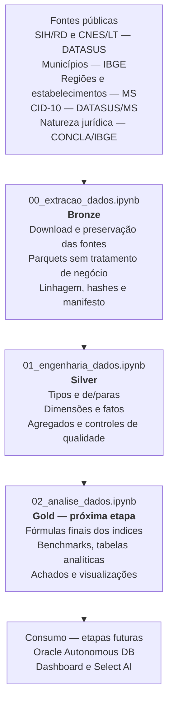

# MedFlow — Painel Inteligente de Acesso Hospitalar

**Enterprise Challenge FIAP × Oracle · Sprint 2 · Equipe Ômega Urban Tech · Turma 1TSCOA**

O MedFlow organiza dados públicos hospitalares para apoiar análises de acesso,
capacidade e desempenho da rede SUS. A v0 cobre o Estado de São Paulo nas
competências de 2022 e 2023.

## Visão geral da v0



| Camada | O que contém | Estado |
|---|---|---|
| **Bronze** | Fontes preservadas, Parquets fiéis, metadados de origem, hashes e manifesto. Não aplica filtro, imputação ou de/para. | concluída e validada |
| **Silver** | Tipagem, domínios, dimensões, fatos, agregados e reconciliações. Todo tratamento de dados fica aqui. | concluída e validada |
| **Gold** | Fórmulas finais, comparações, indicadores e visualizações. | ainda não implementada |
| **Consumo** | Carga no Oracle, dashboard e consultas via Select AI. | etapa futura |

Os notebooks devem ser executados em ordem. As versões `*_executed.ipynb`
registram a última execução integral e permitem conferir as validações sem
reprocessar os dados.

## O que foi validado

| Controle | Resultado |
|---|---:|
| Registros SIH/RD | 5.210.357 |
| Registros CNES/LT | 200.075 |
| AIHs distintas | 5.102.190 |
| Internações novas (`IDENT=1`) | 5.097.456 |
| Continuações de longa permanência (`IDENT=5`) | 112.901 |
| Hospitais | 669 |
| Municípios de São Paulo na referência | 645 |
| Códigos CID observados com descrição | 9.212 / 9.212 |
| Especialidades observadas com de/para | 16 / 16 |
| Hospitais sem região analítica | 0 |
| Hospitais sem nome, esfera atual ou natureza jurídica | 0 |

Nome e esfera administrativa vêm da fotografia atual do CNES. Eles são
identificados como atributos atuais e não são apresentados como cadastro
historicamente vigente em 2022–2023.

## Principais saídas Silver

| Base | Linhas | Papel |
|---|---:|---|
| `fato_internacao` | 5.210.357 | AIHs aprovadas com identificadores, domínios e flags |
| `fato_leitos_mensal` | 15.533 | capacidade de leitos por hospital e competência |
| `base_hospital_mes` | 14.821 | insumos mensais por hospital |
| `base_hospital_espec_mes` | 43.407 | insumos por hospital, especialidade e mês |
| `base_hospital_cid` | 377.708 | insumos por hospital e CID |

Também são geradas seis dimensões: tempo, hospital, município, especialidade,
CID e domínios.

## Escopo metodológico

A Silver prepara e valida os insumos, mas não declara os cinco índices como
metodologicamente aprovados. A sustentação das fórmulas de IPH, IPR, IS, TMH e
CMI será documentada antes da implementação da camada Gold.

Em particular, `QT_DIARIAS` representa diárias faturadas. O cálculo baseado
nesse campo permanece identificado como proxy experimental e não como ocupação
física real.

## Como reproduzir

Os dados não são versionados. O notebook Bronze reconstrói tudo a partir das
fontes públicas.

```bash
uv venv .venv
uv pip install --python .venv/bin/python \
    pandas numpy pyarrow jupyter datasus-dbc dbfread

.venv/bin/jupyter lab
```

Execute:

1. `notebooks/00_extracao_dados.ipynb`;
2. `notebooks/01_engenharia_dados.ipynb`.

Por segurança, os notebooks não substituem saídas existentes sem
`SOBRESCREVER=True`.

## Estrutura

```text
medflow/
├── notebooks/
│   ├── 00_extracao_dados.ipynb
│   ├── 00_extracao_dados_executed.ipynb
│   ├── 01_engenharia_dados.ipynb
│   └── 01_engenharia_dados_executed.ipynb
└── docs/
    ├── PIPELINE.md
    ├── DECISOES_TECNICAS.md
    ├── PENDENCIAS.md
    ├── DICIONARIO_BASES.md
    ├── DOMINIOS.md
    └── RELATORIO_QUALIDADE.md
```

## Fontes

- [SIH/SUS — AIH reduzida (RD)](ftp://ftp.datasus.gov.br/dissemin/publicos/SIHSUS/200801_/Dados)
- [CNES — Leitos (LT)](ftp://ftp.datasus.gov.br/dissemin/publicos/CNES/200508_/Dados/LT)
- [IBGE — API de localidades](https://servicodados.ibge.gov.br/api/v1/localidades/estados/35/municipios)
- [Ministério da Saúde — API de Dados Abertos](https://apidadosabertos.saude.gov.br/)
- [DATASUS — tabelas CID-10](https://www2.datasus.gov.br/cid10/V2008/download.htm)
- [CONCLA/IBGE — Natureza Jurídica 2021](https://concla.ibge.gov.br/documentacao/3051-concla/estrutura/natureza-juridica-2021.html)

## Equipe

Carol Oliveira · Leandro Lopes · Leandro Scutari · Lucas Lima · Pedro Padovan
