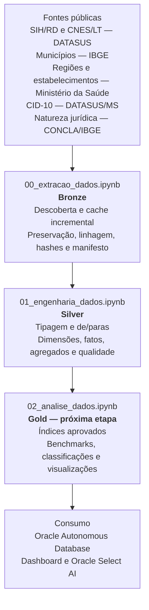

# MedFlow — Inteligência para acesso hospitalar

**Enterprise Challenge FIAP × Oracle · Sprint 2 · Equipe Ômega Urban Tech · Turma 1TSCOA**

O MedFlow transforma dados públicos do SUS em uma base auditável para apoiar
decisões sobre capacidade hospitalar, permanência, mortalidade, custos e
sazonalidade. A versão `v0.1.0` entrega o pipeline Bronze/Silver reproduzível
para o Estado de São Paulo.

O recorte solicitado cobre 2024–2026. A execução validada usa todas as
competências já publicadas simultaneamente no SIH/RD e no CNES/LT:
**janeiro de 2024 a maio de 2026 (29 meses)**. Como 2026 ainda está em curso no
recorte das fontes, os resultados do ano são parciais.

## O problema e o produto

Dados hospitalares públicos são volumosos, distribuídos entre fontes distintas
e carregam diferenças importantes de grão e significado. Uma linha do SIH, por
exemplo, representa uma AIH aprovada e não necessariamente uma nova internação.

O MedFlow organiza essas fontes em fatos, dimensões, agregados e controles de
qualidade para responder perguntas como:

- onde a rede apresenta maior pressão;
- quais hospitais têm permanência acima do padrão regional;
- como a demanda varia ao longo do tempo;
- onde mortalidade e custos precisam ser investigados;
- como um estabelecimento se compara com hospitais semelhantes.

## Para quem

A persona principal é o(a) **secretário(a) de saúde**, que precisa comparar
regiões e orientar a alocação de recursos. A persona secundária é o
**gestor hospitalar**, que precisa acompanhar o próprio estabelecimento e seus
pares.

Cada indicador aprovado deverá mostrar valor atual, comparação temporal,
padrão histórico e interpretação de gestão.

## Os cinco índices

| Sigla | Índice | Pergunta de gestão | Situação na `v0.1.0` |
|---|---|---|---|
| **IPH** | Índice de Pressão Hospitalar | A capacidade de leitos está sob pressão? | proxy faturado preservado; ocupação real bloqueada |
| **IPR** | Índice de Permanência Relativa | A permanência está acima do padrão regional para o mesmo CID? | insumos validados |
| **IS** | Índice de Sazonalidade | A demanda está acima ou abaixo do padrão histórico? | insumos disponíveis; unidade final pendente |
| **TMH** | Taxa de Mortalidade Hospitalar | A mortalidade observada merece investigação? | insumos validados |
| **CMI** | Custo Médio por Internação | Como o custo varia entre hospitais, períodos e especialidades? | insumos disponíveis; fórmula final pendente |

`QT_DIARIAS` representa diárias faturadas. Por isso, o IPH atual permanece
identificado como `proxy_iph_diarias_faturadas`: ele não é apresentado como
ocupação física real.

## Arquitetura



### Bronze

O notebook `00_extracao_dados.ipynb`:

- descobre a interseção de competências SIH/RD e CNES/LT em 2024–2026;
- baixa somente os arquivos ausentes no cache a cada execução mensal;
- preserva as fontes sem filtro, imputação ou regra de negócio;
- tolera evolução de esquema entre competências;
- registra fontes, volumetria, esquema e SHA-256 no `MANIFESTO.json`;
- promove arquivos somente depois da conclusão da escrita.

### Silver

O notebook `01_engenharia_dados.ipynb`:

- aplica tipos e de/paras documentados;
- separa AIH aprovada, internação nova e continuação de longa permanência;
- preserva `N_AIH`, `IDENT`, `COD_IDADE`, `QT_DIARIAS` e `DIAS_PERM`;
- gera dimensões, fatos e agregados para os indicadores;
- mantém nulos em agrupamentos com `dropna=False`;
- promove a saída somente após todas as reconciliações.

## O que esta versão entrega

| Artefato | Resultado |
|---|---:|
| SIH/RD Bronze | 7.034.961 linhas × 117 colunas |
| CNES/LT Bronze | 243.085 linhas × 31 colunas |
| Competências | 29, de 2024-01 a 2026-05 |
| Hospitais | 653 |
| Municípios na referência estadual | 645 |
| CIDs observados e descritos | 9.494 |
| `fato_internacao` | 7.034.961 linhas |
| `fato_leitos_mensal` | 18.690 linhas |
| `base_hospital_mes` | 17.856 linhas |
| `base_hospital_espec_mes` | 52.796 linhas |
| `base_hospital_cid` | 447.334 linhas |

Os dados pesados não são versionados. Os notebooks-fonte, as execuções
validadas e a documentação de qualidade fazem parte da release.

## Qualidade validada

- 7.034.961 AIHs aprovadas reconciliadas;
- 6.909.807 números de AIH distintos;
- 6.905.441 internações novas e 129.520 continuações;
- 100% dos 15 códigos de especialidade observados classificados;
- 100% dos 21 códigos de natureza jurídica observados classificados;
- 100% dos 9.494 CIDs observados com capítulo e descrição;
- 653/653 hospitais com região, nome atual, esfera atual e natureza jurídica;
- zero perda nas agregações hospital/mês, hospital/especialidade/mês e
  hospital/CID;
- duas execuções Silver consecutivas com as mesmas reconciliações;
- zero erros de notebook e zero arquivos parciais residuais.

Quatro hospitais apresentam mais de uma região declarada historicamente no
CNES/LT. O fato analítico usa a referência oficial do Ministério da Saúde pelo
município e preserva o conflito em uma flag de auditoria.

Nome e esfera administrativa vêm da fotografia atual do CNES. Esses atributos
usam sufixo `_atual` e não são apresentados como cadastro historicamente
vigente em cada competência.

## Fontes

- [SIH/SUS — AIH reduzida](ftp://ftp.datasus.gov.br/dissemin/publicos/SIHSUS/200801_/Dados)
- [CNES — Leitos](ftp://ftp.datasus.gov.br/dissemin/publicos/CNES/200508_/Dados/LT)
- [IBGE — API de localidades](https://servicodados.ibge.gov.br/api/v1/localidades/estados/35/municipios)
- [Ministério da Saúde — API de Dados Abertos](https://apidadosabertos.saude.gov.br/)
- [DATASUS — tabelas CID-10](https://www2.datasus.gov.br/cid10/V2008/download.htm)
- [CONCLA/IBGE — Natureza Jurídica 2021](https://concla.ibge.gov.br/documentacao/3051-concla/estrutura/natureza-juridica-2021.html)

## Como reproduzir

Requisitos: Python 3.11+, `uv`, acesso às fontes públicas e espaço local para
os arquivos do DATASUS.

```bash
uv venv .venv

uv pip install --python .venv/bin/python \
    pandas numpy pyarrow jupyter datasus-dbc dbfread

.venv/bin/jupyter lab
```

Execute nesta ordem:

1. `notebooks/00_extracao_dados.ipynb`;
2. `notebooks/01_engenharia_dados.ipynb`.

As versões `*_executed.ipynb` registram a última rodada validada. Em um batch
mensal, a Bronze busca novas competências dentro de 2024–2026 e a Silver só
regenera o recorte quando há mudança ou quando `SOBRESCREVER=True`.

## Roadmap

```text
v0.1.0 — Bronze e Silver validadas
                  ↓
Decisão metodológica dos cinco índices
                  ↓
Notebook Gold e resultados
                  ↓
Oracle Autonomous Database
                  ↓
Dashboard e Oracle Select AI
                  ↓
Pitch e apresentação técnica
```

## Documentação

- `docs/PIPELINE.md` — contrato das camadas;
- `docs/DECISOES_TECNICAS.md` — decisões vigentes;
- `docs/PENDENCIAS.md` — próximos passos;
- `docs/DICIONARIO_BASES.md` — tabelas e colunas;
- `docs/DOMINIOS.md` — cobertura dos de/paras;
- `docs/RELATORIO_QUALIDADE.md` — reconciliações da última execução;
- `docs/METADADOS.json` — recorte, hash Bronze e métricas bloqueantes.

## Equipe

Carol Oliveira · Leandro Lopes · Leandro Scutari · Lucas Lima · Pedro Padovan
