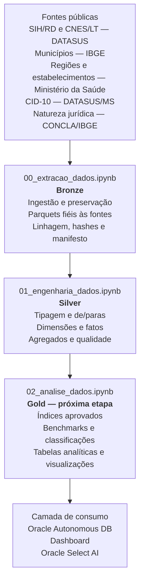

# MedFlow — Painel Inteligente de Acesso Hospitalar

**Enterprise Challenge FIAP × Oracle · Sprint 2 · Equipe Ômega Urban Tech · Turma 1TSCOA**

O MedFlow transforma dados públicos e fragmentados da rede hospitalar do SUS
em uma base estruturada para apoiar decisões sobre capacidade, permanência,
mortalidade, custos e sazonalidade.

A proposta é permitir que secretarias de saúde e gestores hospitalares
entendam não apenas quantas internações ocorreram, mas também:

- onde a rede apresenta maior pressão;
- quais hospitais possuem permanência acima do padrão regional;
- como a demanda varia ao longo do tempo;
- onde mortalidade e custos precisam ser investigados;
- como cada estabelecimento se compara com hospitais semelhantes.

A v0 cobre o Estado de São Paulo nas competências de 2022 e 2023.

## Escopo analisado

| Informação | Resultado |
|---|---:|
| Registros SIH/RD | 5.210.357 |
| AIHs distintas | 5.102.190 |
| Internações novas | 5.097.456 |
| Continuações de longa permanência | 112.901 |
| Registros CNES/LT | 200.075 |
| Hospitais | 669 |
| Municípios na referência estadual | 645 |
| Período | janeiro/2022 a dezembro/2023 |

Todos os dados utilizados são públicos e podem ser reconstruídos pelos
notebooks do projeto.

## Os cinco índices do MedFlow

O produto foi desenhado em torno de cinco perspectivas complementares.

| Sigla | Índice | Pergunta de gestão | Situação na v0 |
|---|---|---|---|
| **IPH** | Índice de Pressão Hospitalar | A capacidade de leitos está sob pressão? | proxy disponível; metodologia final pendente |
| **IPR** | Índice de Permanência Relativa | A permanência está acima do padrão regional para o mesmo CID? | insumos validados |
| **IS** | Índice de Sazonalidade | A demanda está acima ou abaixo do padrão histórico? | insumos disponíveis |
| **TMH** | Taxa de Mortalidade Hospitalar | A mortalidade observada merece investigação? | insumos validados |
| **CMI** | Custo Médio por Internação | Como o custo varia entre hospitais, períodos e especialidades? | fórmula final pendente |

A camada Silver prepara os insumos necessários, mas a aprovação metodológica
das fórmulas será feita antes da construção da camada Gold.

Em particular, `QT_DIARIAS` representa diárias faturadas. Por isso, o cálculo
atualmente reproduzido para o IPH é tratado como proxy experimental, não como
evidência de ocupação física real.

## Arquitetura de dados



### Bronze — ingestão

Responsável por adquirir e preservar as fontes.

Contém:

- arquivos SIH/RD e CNES/LT;
- referências de municípios e regiões de saúde;
- tabelas CID-10;
- cadastro atual dos estabelecimentos;
- referência de natureza jurídica;
- metadados de origem, volumetria e hashes.

A Bronze não aplica filtro analítico, imputação, de/para ou regra de negócio.

### Silver — engenharia de dados

Responsável por transformar os dados ingeridos em bases consistentes e
auditáveis.

Contém:

- tipagem dos campos analíticos;
- de/paras e descrições oficiais;
- separação entre AIH aprovada, internação nova e continuação;
- dimensões de hospital, município, tempo, especialidade, CID e domínios;
- fatos de internação e leitos;
- agregados preparados para os indicadores;
- flags de qualidade e reconciliação dos totais.

Todos os tratamentos ficam concentrados no notebook
`01_engenharia_dados.ipynb`.

### Gold — análise

Será responsável por:

- implementar as fórmulas metodologicamente aprovadas;
- definir benchmarks e volumes mínimos;
- tratar denominadores nulos;
- produzir tabelas analíticas;
- gerar achados e visualizações reproduzíveis.

A Gold ainda não está implementada nesta v0.

## Principais bases Silver

| Base | Linhas | Finalidade |
|---|---:|---|
| `fato_internacao` | 5.210.357 | tabela central das AIHs aprovadas |
| `fato_leitos_mensal` | 15.533 | capacidade hospitalar mensal |
| `base_hospital_mes` | 14.821 | insumos mensais por hospital |
| `base_hospital_espec_mes` | 43.407 | insumos por especialidade |
| `base_hospital_cid` | 377.708 | insumos por hospital e CID |

## Qualidade e cobertura

A execução atual apresenta:

- 16/16 especialidades observadas com de/para;
- 22/22 códigos de natureza jurídica mapeados;
- 9.212/9.212 códigos CID observados com descrição;
- 669/669 hospitais com região analítica;
- 669/669 hospitais com nome, esfera atual e natureza jurídica;
- zero perda de registros nas agregações;
- reconciliação integral dos 5.210.357 registros SIH.

Nome e esfera administrativa vêm da fotografia atual do CNES. Esses atributos
são marcados como atuais e não são apresentados como cadastro historicamente
vigente em 2022–2023.

## Fontes utilizadas

- [SIH/SUS — AIH reduzida](ftp://ftp.datasus.gov.br/dissemin/publicos/SIHSUS/200801_/Dados)
- [CNES — Leitos](ftp://ftp.datasus.gov.br/dissemin/publicos/CNES/200508_/Dados/LT)
- [IBGE — API de localidades](https://servicodados.ibge.gov.br/api/v1/localidades/estados/35/municipios)
- [Ministério da Saúde — API de Dados Abertos](https://apidadosabertos.saude.gov.br/)
- [DATASUS — tabelas CID-10](https://www2.datasus.gov.br/cid10/V2008/download.htm)
- [CONCLA/IBGE — Natureza Jurídica 2021](https://concla.ibge.gov.br/documentacao/3051-concla/estrutura/natureza-juridica-2021.html)

## Como reproduzir

Os dados pesados não são versionados. O notebook Bronze reconstrói as bases
diretamente das fontes públicas.

```bash
uv venv .venv

uv pip install --python .venv/bin/python \
    pandas numpy pyarrow jupyter datasus-dbc dbfread

.venv/bin/jupyter lab
```

Execute, nesta ordem:

1. `notebooks/00_extracao_dados.ipynb`;
2. `notebooks/01_engenharia_dados.ipynb`.

As versões `*_executed.ipynb` registram a última execução validada.

Por segurança, os notebooks não substituem saídas existentes sem
`SOBRESCREVER=True`.

## Roadmap

```text
Bronze e Silver validadas
          ↓
Decisão metodológica dos cinco índices
          ↓
Notebook Gold e geração dos resultados
          ↓
Carga no Oracle Autonomous Database
          ↓
Dashboard navegável
          ↓
Consultas com Oracle Select AI
          ↓
Pitch e apresentação técnica
```

## Documentação

- `docs/PIPELINE.md` — contrato das camadas;
- `docs/DECISOES_TECNICAS.md` — decisões vigentes;
- `docs/PENDENCIAS.md` — próximos passos;
- `docs/DICIONARIO_BASES.md` — tabelas e colunas;
- `docs/DOMINIOS.md` — cobertura dos de/paras;
- `docs/RELATORIO_QUALIDADE.md` — reconciliações da última execução.

## Equipe

Carol Oliveira · Leandro Lopes · Leandro Scutari · Lucas Lima · Pedro Padovan
